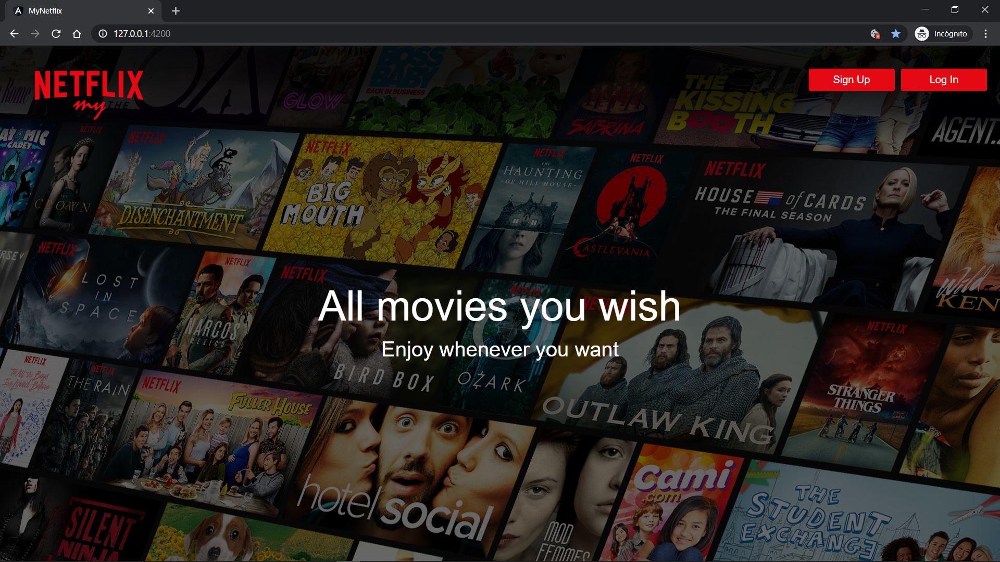
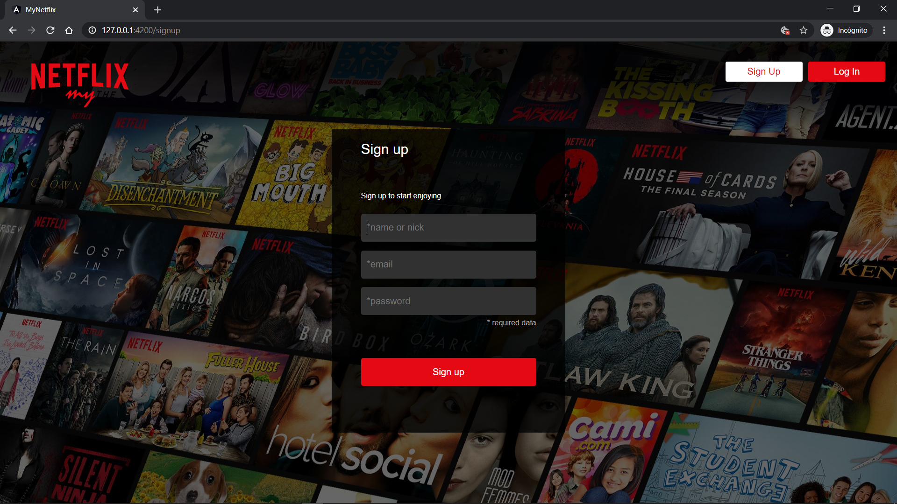
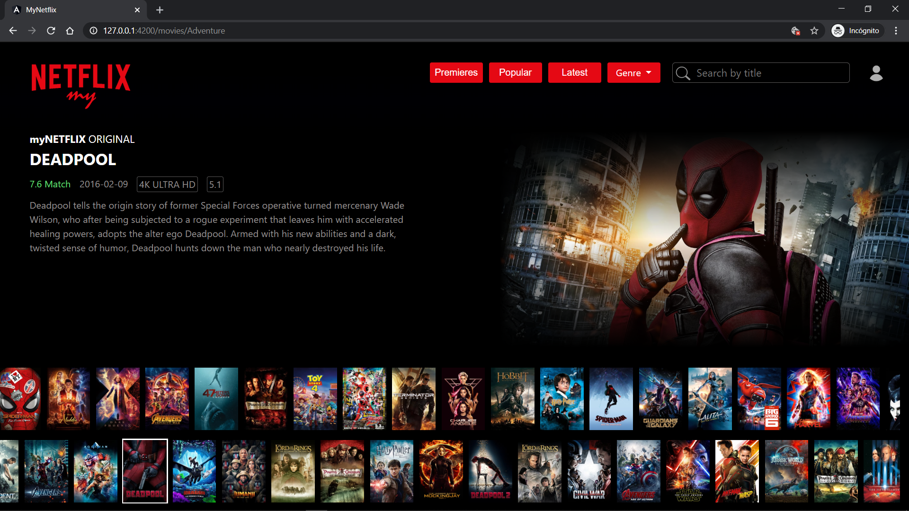
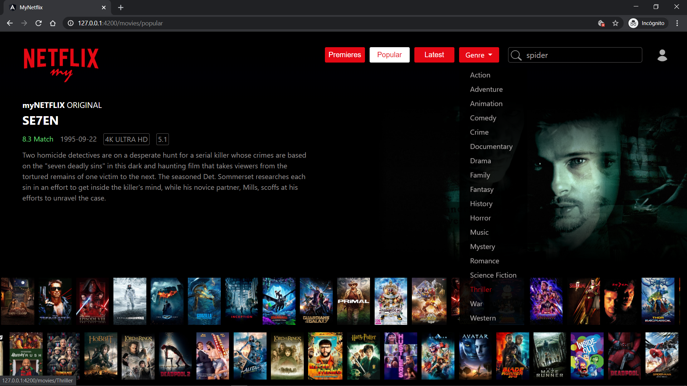

# myNetflix

> Frontend desarrollado en Angular version 8.3.19. que simula un modelo de negocio de alquiler de peliculas al estilo NETFLIX.

> Consume el backend < myNetflixAPI > desarrolado en NodeJS / Express / MongoDB / Mongoose.

## Screenshots

